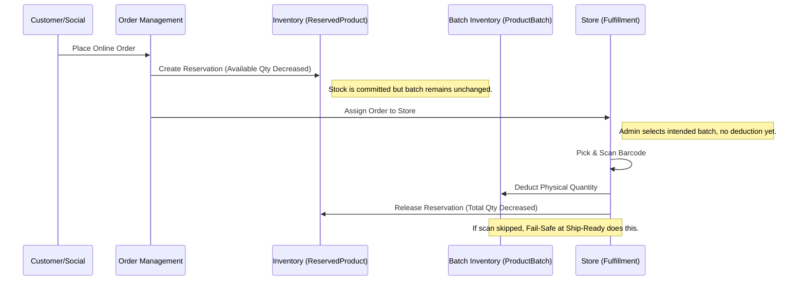

# Detailed Report: Inventory Stock Deduction Shift & Reservation Refactor

## 1. Executive Summary
This document provides a comprehensive technical breakdown of the architectural shift in Errum V2's inventory management. The primary change moves physical stock deduction from the **Order Assignment** phase to the **Scanning and Fulfillment** phase for all online orders (E-commerce and Social Commerce). 

This shift addresses critical issues related to inventory accuracy, physical picking flows, and multi-store logistics. By decoupling "Commitment" (Reservation) from "Deduction" (Physical Movement), the system now provides a more realistic representation of warehouse operations.

## 2. Architectural Overview

### 2.1 The Two-Phase Commitment Model
Previously, the system deducted stock from a specific store's batch as soon as an order was assigned to that store. This created problems if the item was later found to be missing, damaged, or if the order was re-assigned.

The new model implements a **Two-Phase Commitment**:
1.  **Phase 1: Reservation (Commitment)**
    - Triggered at Order Creation.
    - Updates `ReservedProduct` table (`reserved_inventory` ↑, `available_inventory` ↓).
    - Ensures that globally available stock is tracked even before store assignment.
2.  **Phase 2: Deduction (Fulfillment)**
    - Triggered at Barcode Scanning or Shipping.
    - Updates `ProductBatch` (Physical `quantity` ↓).
    - Updates `ReservedProduct` (`reserved_inventory` ↓, `total_inventory` ↓).

### 2.2 Visualizing the Flow



---

## 3. Detailed Technical Changes

### 3.1 Observer System Enhancements
The `OrderObserver` and `OrderItemObserver` now serve as the central source of truth for reservation lifecycle management.

#### [REFACTORED] `OrderObserver.php`
We added robust hooks to handle reversal of commitments.
```php
public function updated(Order $order): void
{
    if ($order->isDirty('status')) {
        $reversalStatuses = ['cancelled', 'refunded'];
        
        // Handle inventory reservation release for online orders
        if (in_array($order->status, $reversalStatuses)) {
            if (in_array($order->order_type, ['ecommerce', 'social_commerce'])) {
                foreach ($order->items as $item) {
                    // CRITICAL: Only release if NOT yet physically deducted
                    if ($item->scan_status !== 'scanned') {
                        $reservedRecord = ReservedProduct::where('product_id', $item->product_id)->first();
                        if ($reservedRecord) {
                            $reservedRecord->decrement('reserved_inventory', $item->quantity);
                            $reservedRecord->increment('available_inventory', $item->quantity);
                        }
                    }
                }
            }
        }
    }
}
```

#### [NEW] `deleted` Event Hook
To prevent orphaned reservations, a `deleted` hook was implemented:
```php
public function deleted(Order $order): void
{
    if (in_array($order->order_type, ['ecommerce', 'social_commerce'])) {
        foreach ($order->items as $item) {
            if ($item->scan_status !== 'scanned') {
                $reservedRecord = ReservedProduct::where('product_id', $item->product_id)->first();
                if ($reservedRecord) {
                    $reservedRecord->decrement('reserved_inventory', $item->quantity);
                    $reservedRecord->increment('available_inventory', $item->quantity);
                }
            }
        }
    }
}
```

---

### 3.2 Fulfillment Controller Overhaul
The `StoreFulfillmentController` is now the primary gateway for physical stock movements.

#### Barcode Scanning logic (`scanBarcode`)
When a barcode is scanned, the system performs a multi-table atomic update:
1.  Verified barcode status.
2.  Assigned barcode to `OrderItem`.
3.  **Deducted** quantity from the specific `ProductBatch`.
4.  **Released** the reservation from `ReservedProduct`.

#### Fail-Safe Logic (`markReadyForShipment`)
Recognizing that physical operations are messy (unscannable barcodes, manual overrides), we implemented a fail-safe:
```php
$pendingItems = $order->items()->where('scan_status', 'pending')->get();
foreach ($pendingItems as $item) {
    if ($item->product_batch_id) {
        $batch = ProductBatch::find($item->product_batch_id);
        if ($batch) {
            $batch->decrement('quantity', $item->quantity); // Physical deduction
            
            // Release reservation
            $reservedProduct = ReservedProduct::where('product_id', $item->product_id)->first();
            if ($reservedProduct) {
                $reservedProduct->decrement('reserved_inventory', $item->quantity);
                $reservedProduct->decrement('total_inventory', $item->quantity);
            }
        }
    }
}
```

---

### 3.3 Counter (POS) Consistency
While online orders are deferred, **Counter Sales** remain immediate. This is a business requirement for POS terminals where the product is physically handed to the customer at the time of entry.

Modified `OrderController.php` to ensure this distinction:
```php
$shouldDeductNow = $batch && ($request->order_type === 'counter');
if ($shouldDeductNow) {
    $batch->quantity -= $quantity;
    $batch->save();
}
```

---

## 4. Complex Scenarios & Edge Cases

### 4.1 Re-assignment of Stores
If an order is unassigned from Store A and moved to Store B:
- **Old Behavior**: Stock in Store A was deducted and then "returned" (if handled correctly), or lost in Store A.
- **New Behavior**: No stock was ever deducted from Store A's batch. Only a logical assignment was made. Re-assigning is now a purely administrative metadata change.

### 4.2 Partial Fulfillment & Cancellation
If a customer orders 3 items, 2 are scanned, and the order is then cancelled:
- `OrderObserver` detects that 2 items are `scanned` and 1 is `pending`.
- It **only** reverses the reservation for the `pending` item.
- The 2 physical items (already deducted from batch) would require a separate "return/restock" flow if the physical goods were returned to the shelf.

### 4.3 Overselling Prevention at Checkout
The `EcommerceOrderController` performs a pessimistic lock on `ReservedProduct` during checkout:
```php
$reservedRecord = ReservedProduct::where('product_id', $cartItem->product_id)
    ->lockForUpdate()
    ->first();
if ($reservedRecord->available_inventory < $cartItem->quantity) {
    throw new Exception("Stock out!");
}
```
This ensures that the shift in *deduction* timing does not compromise the integrity of *availability* checks.

---

## 5. Summary of Bug Fixes

1.  **Duplicate Deduction**: Fixed a bug where assignment and fulfillment both deducted stock, causing double depletion.
2.  **Orphaned Reservations**: Fixed issue where cancelling a guest order left the reservation trapped in the database.
3.  **POS Stock Lag**: Ensured POS remains "Real-Time" while e-commerce moves to "Operational-Time".
4.  **Batch Inaccuracy**: Resolved discrepancy between physical shelf count and `product_batches` quantity during the "Picking" status.

## 6. Future Recommendations
- **Scanning UI**: Implement a "Bulk Scan" or "Force Deduct" button for batches with many identical items without unique barcodes.
- **Audit Logging**: Add specific inventory activity logs for the "Fail-Safe" deductions to track how often items skip the scanning process.

---
*End of Report*
