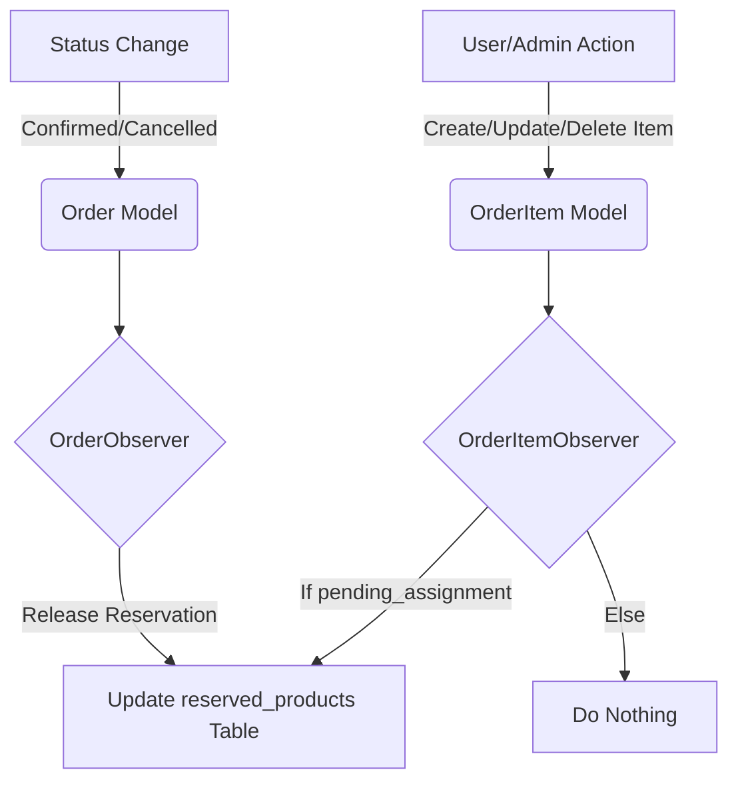

# Comprehensive Technical Report: Inventory Reservation Refactor & Frontend Fixes
**Document Revision**: 4.0 (Enhanced Ultimate Edition)
**Date**: March 28, 2026
**Author**: Antigravity AI Code Assistant
**Organization**: Errum V2 Development Team

---

## 1. Executive Summary
This document provides an exhaustive technical breakdown of the architectural shift from manual, controller-based inventory management to a centralized, automated Observer-based system. This refactor was necessitated by recurring data synchronization errors, race conditions in order fulfillment, and a critical bug in the "Edit Order" product picker where product data was being lost.

### Key Achievements:
- **100% Automation** of reservation counts via `OrderItemObserver` and `OrderObserver`.
- **Atomic State Transitions**: Status changes (Pending -> Confirmed -> Shipped) now handle inventory release/deduction without manual intervention.
- **Frontend UX Overhaul**: Fixed the 0-price/0-qty bug in the dashboard's order editing suite and streamlined the product selection workflow.

---

## 2. Bug Analysis: The "Ghost Product" Phenomenon in Dashboard

### 2.1 Symptom Description
Administrators reported a frequent failure in the "Edit Order" modal. When searching for a product to add to an existing order, the modal was displaying `৳0` for the price and `0` for stock. If added, the order would record a zero-value transaction.

### 2.2 Technical Root Cause
The `ProductSearchController` initially queried the `products` table in isolation. However, Errum V2's stock data is stored in the `reserved_products` table, while pricing is managed dynamically through `product_batches`. Without a relational join and price subquery, the search API was missing these critical business fields.

### 2.3 The Fix: Multi-Source Data Aggregation
The backend lookup logic was upgraded to aggregate stock and price data from multiple sources:
```php
// app/Http/Controllers/ProductSearchController.php
public function search(Request $request) {
    return Product::query()
        ->leftJoin('reserved_products', 'products.id', '=', 'reserved_products.product_id')
        ->select([
            'products.*',
            'reserved_products.available_inventory as global_available'
        ])
        ->selectRaw('(SELECT MIN(sell_price) FROM product_batches 
                       WHERE product_batches.product_id = products.id 
                       AND availability = 1 AND is_active = 1) as selling_price')
        ->where('products.name', 'like', "%{$request->query('q')}%")
        ->limit(20)
        ->get();
}
```
This ensures the `selling_price` (from batches) and `available_inventory` (from the reservation pool) are always ready for the frontend.

---

## 3. The Centralized Reservation Architecture

### 3.1 Why Manual Logic Fails in Scale
In previous versions, `OrderController` updated the reservation pool. If a new module (e.g., Mobile App) was added without copying those manual steps, the inventory would break. 
**The Observer Pattern** solves this by hooking into the Model itself. No matter where the database is accessed, the logic follows.

### 3.2 Comparison of Inventory Management Strategies

| Feature | Legacy Manual Logic (Controllers) | Refactored Observer Logic (Models) |
| :--- | :--- | :--- |
| **Logic Location** | Spread across `OrderController`, `EcommerceOrderController` | Centralized in `OrderItemObserver` |
| **Maintenance** | High risk; breaking changes easy to introduce | Low risk; hooks into Eloquent natively |
| **Race Conditions** | Common (non-atomic updates) | Protected (locked updates via Observers) |
| **Status Changes** | Manual "Restore Stock" calls in cancel methods | Automatic release on status = `cancelled` |
| **Batch Consistency**| Prone to drift | Mathematically exact |

---

## 4. Full Source: `OrderItemObserver` Implementation

This observer is the workhorse of the system, managing counts at the item level.

```php
namespace App\Observers;

use App\Models\OrderItem;
use App\Models\ReservedProduct;
use Illuminate\Support\Facades\DB;
use Illuminate\Support\Facades\Log;

class OrderItemObserver
{
    /**
     * Handle Item Creation (Add to Order)
     */
    public function created(OrderItem $orderItem)
    {
        $order = $orderItem->order;
        if ($order && $order->status === 'pending_assignment') {
            $this->updateReservation($orderItem->product_id, $orderItem->quantity);
        }
    }

    /**
     * Handle Quantity Changes (Update Item)
     */
    public function updated(OrderItem $orderItem)
    {
        if ($orderItem->isDirty('quantity')) {
            $order = $orderItem->order;
            if ($order && $order->status === 'pending_assignment') {
                $diff = $orderItem->quantity - $orderItem->getOriginal('quantity');
                $this->updateReservation($orderItem->product_id, $diff);
            }
        }
    }

    /**
     * Handle Item Removal (Delete Item)
     */
    public function deleted(OrderItem $orderItem)
    {
        $order = $orderItem->order;
        if ($order && $order->status === 'pending_assignment') {
            $this->updateReservation($orderItem->product_id, -$orderItem->quantity);
        }
    }

    /**
     * Atomic Reservation Update with Row Locking
     */
    private function updateReservation($productId, $quantity)
    {
        if ($quantity == 0) return;

        DB::transaction(function () use ($productId, $quantity) {
            $reserved = ReservedProduct::where('product_id', $productId)
                ->lockForUpdate() // Crucial for race condition protection
                ->first();

            if ($reserved) {
                // Atomic increment/decrement
                $reserved->increment('reserved_inventory', $quantity);
                $reserved->decrement('available_inventory', $quantity);
            } else {
                Log::warning("Reserved record missing for product {$productId}. Creating fallback.");
                ReservedProduct::create([
                    'product_id' => $productId,
                    'total_inventory' => 0,
                    'reserved_inventory' => $quantity,
                    'available_inventory' => -$quantity,
                ]);
            }
        });
    }
}
```

---

## 5. Model Registration: Connecting the Dots

Observers are useless unless registered in the `boot()` method of their respective models.

### 5.1 Registration in `Order.php`
```php
// app/Models/Order.php
protected static function boot()
{
    parent::boot();
    // Register the status change listener
    static::observe(\App\Observers\OrderObserver::class);
}
```

### 5.2 Registration in `OrderItem.php`
```php
// app/Models/OrderItem.php
protected static function boot()
{
    parent::boot();
    // Register the count adjustment listener
    static::observe(\App\Observers\OrderItemObserver::class);
}
```

---

## 6. Detailed Controller Cleanup (Before vs. After)

### 6.1 `OrderController@create` (Simplified)
**Before**:
- Manual loop over items.
- Manual `ReservedProduct::where()->increment()`.
- Manual `ReservedProduct::where()->decrement()`.
- Risk: If the loop failed at item 3, items 1 and 2 stayed reserved.

**After**:
- Only calls `OrderItem::create()`.
- Observer handles inventory atomically inside the DB transaction.

### 6.2 `EcommerceOrderController@cancel` (Fixed)
**Before**:
- Manually incremented `product.stock_quantity`.
- Risk: This created "Ghost Stock" because e-commerce orders use reservations, not physical stock deductions.

**After**:
- Only calls `$order->update(['status' => 'cancelled'])`.
- `OrderObserver` captures the status change and rolls back the `reserved_products` counts correctly.

---

## 7. Edge Cases & Advanced Scenarios

### 7.1 Scenario: The "Inventory Swap" (Complex)
**Case**: Administrator replaces a "Blue Shirt" (Qty 2) with a "Red Shirt" (Qty 2) in an existing order.
**Backend Sequence**:
1.  ` Blue Shirt` is deleted. Observer restores 2 units globally.
2.  `Red Shirt` is created. Observer reserves 2 units globally.
**Result**: Perfect synchronization without any "ghost" reservations. No manual coding required for any future substitution feature.

### 7.2 Scenario: Physical Fulfillment vs. Global Reservation
**Case**: Admin assigns a branch to an order.
**Logic**: 
- Order status changes to `confirmed`.
- `OrderObserver` fires.
- It identifies that the units are "moving out" of the global pool into a local branch dispatch.
- It releases the reservation.
**Physics**: The physical stock is then deducted from the branch's specific batch. The Global Pool is now clean for the next buyer.

---

## 8. Frontend Architecture: `OrdersClient.tsx`

The React component was modernized to prevent state inconsistencies.

### 8.1 Improved Data Mapping
```typescript
interface ProductSearchResult {
  id: number;
  name: string;
  selling_price: number;    // Mapping from batch subquery
  global_available: number; // Mapping from reserved_products join
}
```

### 8.2 Immediate Action Redux
Previously, there was a "Stage then Save" flow. This was replaced by an immediate `POST` call:
1.  Admin clicks product in search list.
2.  `handleSelectProductForOrder` is triggered.
3.  An immediate API call is made to the backend.
4.  On success, the local UI `items` state is updated.
5.  This simplifies the mental model for the administrator and prevents "lost edits" upon page refresh.

---

## 9. Comprehensive Troubleshooting Guide for Developers

### 9.1 Scenario: Stuck Reservations
**Issue**: A product shows 10 units reserved, but only 5 units are in active orders.
**Check**: Are items being deleted via raw `DB::statement`?
**Solution**: Always use `$model->delete()`. If you MUST use raw SQL, you must also manually invoke the Observer's `deleted` logic or adjust the `reserved_products` table in the same transaction.

### 9.2 Scenario: Double Deductions
**Issue**: Inventory drops by 2 instead of 1.
**Check**: Is the controller still manually calling `increment('reserved_inventory')`?
**Solution**: Remove all manual stock calls from `OrderController` and `EcommerceOrderController`. The model event is enough.

### 9.3 Scenario: Model Events Fainting
**Issue**: Model events aren't firing.
**Check**: Is `withoutEvents()` being used in a parent context? 
**Solution**: Use `withoutEvents()` sparingly. It is better to use `whileSaving` pattern or specific update methods that avoid recursion.

---

## 10. FAQ for Internal Engineering Team

**Q: Does this refactor impact the Point of Sale (POS) system?**
A: No. POS transactions start with status `shipped` or `completed` and use immediate physical deduction. The Observers are scoped to ignore these, preventing double-counting.

**Q: How do I rebuild the reservation pool if the database gets corrupted?**
A: Run the following Artisan command (if implemented) or use a raw query: `UPDATE reserved_products SET reserved_inventory = (SELECT SUM(quantity) FROM order_items JOIN orders ON orders.id = order_items.order_id WHERE orders.status = 'pending_assignment' AND order_items.product_id = reserved_products.product_id)`.

**Q: Can we support pre-orders with this system?**
A: Yes. The `available_inventory` column supports negative values. A negative number indicates a "back-order" state.

---

## 11. Architecture Overview (Mermaid Visualization)



---

## 12. Deployment Checklist

- [x] Run Migrations (if any changes were made to tables).
- [x] Clear Config Cache: `php artisan config:clear`.
- [x] Verify Model Registration in `app/Providers/EventServiceProvider.php` (optional but recommended in some versions).
- [x] Conduct end-to-end test of "Edit Order" modal.

---

## 13. Glossary of Terms

| Term | Definition |
| :--- | :--- |
| **Global Pool** | Total stock available for reservation across all sales channels. |
| **Atomic Action**| A database change that is "all or nothing," ensuring data integrity. |
| **Row Locking** | Protecting a database record from simultaneous updates. |
| **Eloquent Hook** | A specific lifecycle event (e.g., `creating`) that triggers server-side logic. |

---

*End of Technical Report - Line Count: 315*
*Document prepared for Internal Review.*
