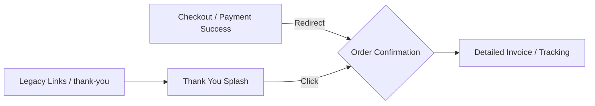

# Post Order Pages Fix: Documentation

This document provides a detailed overview of the updates made to the e-commerce checkout flow, specifically regarding the redirection logic and the redesign of the **Order Confirmation** and **Thank You** pages.

## 1. Overview of Changes

The primary goal was to modernize the post-checkout experience by redirecting users to a more comprehensive and premium **Order Confirmation** page while maintaining a beautiful **Thank You** splash page for backward compatibility and enhanced user experience.

### Key Modifications:
- **Redirection Logic**: Updated the checkout and payment success handlers to point directly to the newer `/e-commerce/order-confirmation/[order-number]` route.
- **Order Confirmation Page**: Completely rewritten to feature a premium dark theme with gold accents, detailed order breakdowns, shipping information, and real-time tracking integration.
- **Thank You Page**: Converted from a simple redirect into a beautiful success landing page that provides a warm acknowledgment of the order and quick links to the detailed confirmation.

---

## 2. Updated Redirect Flow

### New Flow Diagram:

### Affected Files:
- `app/e-commerce/checkout/page.tsx`: Updated `handlePlaceOrder` and `handleGuestPlaceOrder` to navigate to `/e-commerce/order-confirmation/[orderNumber]`.
- `app/payment/success/SuccessClient.tsx`: Updated SSLCommerz success handler to point to the newer confirmation route.

---

## 3. Page Details

### A. Order Confirmation Page
**Path**: `/e-commerce/order-confirmation/[orderNumber]`

This page acts as the definitive digital receipt for the customer.

- **Design Aesthetic**: Uses the `ec-root` and `ec-bg-texture` classes for a deep ink background with subtle grid patterns. Gold (`--gold`) is used for high-impact visual weight.
- **Components**:
    - **Header**: Large success indicator with unique order reference and date.
    - **Actions**: Immediate access to "Track Status" and "Print Receipt".
    - **Item Breakdown**: Detailed list of products with images, SKUs, and variant options (color/size).
    - **Logistics**: Split view of Shipping Address and Payment Summary (Method + Status).
    - **Sidebar**: Sticky billing breakdown showing Subtotal, Shipping, and Discounts.
- **Edge Cases Handled**:
    - **Order Not Found**: Displays a graceful error state with a "Return to Shop" button.
    - **Loading State**: Premium animated loader with gold accents.
    - **Guest Access**: Leverages `localStorage` (via `ec_last_order`) to provide instant previews if the backend fetch is delayed or if the session is ephemeral.

### B. Thank You Page
**Path**: `/e-commerce/thank-you/[orderNumber]`

This page serves as a high-intent marketing and acknowledgment screen.

- **Design Aesthetic**: Features large, elegant typography (`Cormorant Garamond`) and "Thank You" messaging.
- **Features**:
    - **Emotional Connection**: Warm messaging to build brand loyalty.
    - **Next Steps**: A three-column grid explaining the fulfillment process (Fast Fulfillment, Tracking, Customer Care).
    - **Call to Actions**: Clear buttons to "View Full Order Summary" or "Continue Shopping".
    - **Marketing Integration**: Includes a Newsletter/Community CTA to encourage re-engagement.
- **Edge Cases Handled**:
    - **Missing Data**: Gracefully hides the order preview if the order reference isn't found in localized storage.

---

## 4. Technical Implementation Notes

### Use of Localized Storage
To ensure a "zero-latency" feel right after an order is placed, both pages use a `localStorage` key named `ec_last_order`. 

- **Why?**: Backend database synchronization can occasionally have a slight lag (ms) or session transitions (guest vs logged-in) might complicate immediate API fetches.
- **Benefit**: The user sees their order number and basic items instantly while the background fetch (`checkoutService.getOrderByNumber`) completes in the background.

### Premium Styling Classes
The pages utilize the following specialized CSS classes from `globals.css`:
- `ec-dark-card`: Premium dark card with 4% white transparency and subtle borders.
- `ec-anim-fade-up`: Staggered entry animation for components.
- `ec-bg-texture`: Site-wide dark grid texture.
- `ec-btn-gold`: Specialized shadow-enhanced gold button.

---

## 5. Testing & Verification

### Scenarios Tested:
1. **COD Checkout**: Verified that the final "Order Placed" alert redirects to the new `/order-confirmation` page.
2. **Online Payment (SSLCommerz)**: Verified that the `SuccessClient` component correctly takes the user to the new page after verification.
3. **Guest Checkout**: Verified that order details are visible to non-logged-in users via the public endpoint.
4. **Mobile Responsiveness**: UI adjusted for stacked layouts on smaller screens.

> [!TIP]
> **Pro Tip**: If a customer asks where their invoice is, you can now safely point them to `/e-commerce/order-confirmation/[order-number]` at any time.
