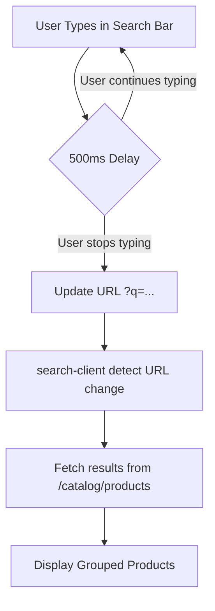

# Search Feed Page Changes

This document details the complete rewrite of the Search feed page (`app/e-commerce/search/page.tsx` and `app/e-commerce/search/search-client.tsx`). The primary goal was to bring the search experience in line with the premium aesthetics and advanced functionality of the category and product feed pages.

## Summary of Key Changes

### 1. Robust Search Logic & UX
- **Debounced Search**: Implemented a 500ms debounce on character change. Searches are now triggered automatically as the user types, without needing an "Enter" press.
- **Search Relevance**: Enhanced the backend `getProducts` method to use **relevance ordering** (via `searchWithRelevance`) as the default sort when a search query is provided.
- **URL Synchronization**: All filters (search query, price range, sorting, pagination) are synchronized with the URL. This allows users to share search results or use the browser's back button seamlessly.

### 2. Premium UI Integration
- **PremiumProductCard**: Replaced basic product listings with the `PremiumProductCard` component, featuring SKU grouping, in-stock badges, and the interactive heart (wishlist) button.
- **Refined Header**: Updated the search header with a glassmorphism search bar, Google Fonts (Jost & DM Mono), and subtle background gradients.
- **Consistent Layout**: Aligned the layout with `e-commerce/products`, featuring a dedicated price range sidebar on desktop and a filter drawer on mobile.

### 3. Advanced Filtering & Sorting
- **Price Range Selector**: Integrated the `PriceRangeSelector` component in the sidebar.
- **Filter Dropdown**: Added options to sort by "Newest First", "Price: Low to High", and "Price: High to Low".
- **Pagination**: Implemented a 15-product per page system with navigation controls, supporting distinct SKU groups for a cleaner browsing experience.

## Logic Flow



## Technical Implementation Details

### Backend: `EcommerceCatalogController`
The `getProducts` method was updated to handle search queries with high priority relevance ordering:
```php
if (in_array($sortBy, $allowedSorts)) {
    $query->orderBy($sortBy, $sortOrder === 'asc' ? 'asc' : 'desc');
} elseif ($search) {
    // Relevance ordering: Matches at start of name/SKU rank higher
    $this->searchWithRelevance($query, ['name', 'description', 'sku'], $search, 'name');
} else {
    $query->orderBy('created_at', 'desc');
}
```

### Frontend: `SearchClient`
The component uses `useSearchParams` as the single source of truth for the search state.
- **Pagination**: Calculated based on the total items returned from the grouping-aware backend.
- **Loading States**: Uses skeletal placeholders for smoother transitions.

## Edge Cases Handled
- **Short Queries**: The frontend permits searching even with one character (starting from URL update), while the backend handles the search logic robustly.
- **No Results**: Displays a themed "No matches found" state with a clear "Clear All Filters" call to action.
- **Mobile Experience**: A separate filter drawer ensures the same level of control on small screens without cluttering the main results.
- **Image Fallbacks**: Integrated error handling for product images to maintain a clean UI even if remote assets fail to load.
